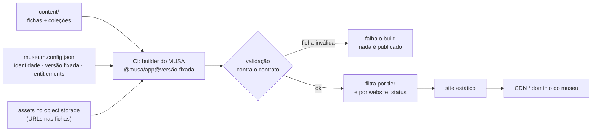

# DemoMuseum

Repositório **cliente** do **MUSA app-service** — e, ao mesmo tempo, o *cliente virtual* que
usamos para testar o sistema de ponta a ponta.

Este repo existe para provar uma coisa só: que criar o site de um museu é **um comando para o repo
e um comando para o build**, sem que a equipe MUSA toque em nada depois disso.

> **Status: esqueleto.** Nada aqui está ligado ainda, porque o artefato publicado do MUSA
> (`musa` em `museum.config.json`) ainda não existe. A pasta `content/` está vazia de propósito.

---

## O que este repositório é

**É** o repositório de um cliente: contém **conteúdo** (as peças, coleções e imagens do museu),
**configuração** (identidade, módulos contratados, versão fixada do MUSA) e o **workflow** que
constrói e publica o site.

**Não é** — e isso é a decisão central de arquitetura — um lugar onde vive o código do MUSA.
Não há `node_modules` do MUSA, não há binário copiado, não há fork.

| | Onde vive |
|---|---|
| Site publicado | CDN / host estático (domínio do museu) |
| Conteúdo curadorial (fichas, coleções) | este repo — **o seed**, versionado e auditável |
| Assets pesados (GLB, USD, imagens de alta) | object storage; a `ficha.json` referencia por URL |
| Edições do dia a dia da curadoria | banco + índice do MUSA (não este repo) |
| Código da plataforma | `Agua-Games/Musa_app-service` — consumido **por versão fixada** |

## Por que não copiar o MUSA para cá

Se o produto fosse copiado para dentro deste repo, este repo viraria uma *ramificação* do produto:
cada atualização exigiria merge manual, cada cliente teria uma versão diferente, e não haveria
rollback atômico. Em vez disso, `museum.config.json` **fixa uma versão**, e atualizar é subir esse
número e reconstruir. A justificativa completa está em
`Agua-Games/Musa_app-service → docs/adr/0003-onboarding-de-clientes.md`.

## Por que não existe pasta de assets grandes aqui

Binário no histórico de um repo de código é dívida permanente: todo clone carrega para sempre. O
projeto já aprendeu isso na prática — 26 MB de `.glb` foram retirados do histórico da plataforma em
2026-09-17. Modelos e imagens originais vão para o bucket do cliente; aqui ficam apenas referências.

---

## A pipeline que faz deste repositório um cliente do MUSA



As cinco etapas, em detalhe:

1. **Onde está o MUSA.** O builder obtém `@musa/app@<versão fixada em museum.config.json>` — pacote
   npm, imagem de container ou bundle estático. Nada disso é copiado para dentro deste repo.
2. **Validação.** Cada `ficha.json` é validada contra o contrato
   (`schemas/ficha.schema.json`, na plataforma). Ficha fora do contrato **falha o build**. É isso
   que dá sentido a "asset watertight": não é promessa, é portão.
3. **Gating no build, não no browser.** O site só é gerado com o conteúdo que o museu **contratou**
   (tier/módulos vindos dos entitlements do servidor) e **publicou** (`website_status`). Numa build
   estática, filtrar no cliente equivale a não filtrar: o payload é público.
4. **Publicação.** O site estático é enviado ao CDN no domínio do museu.
5. **Curadoria contínua.** Edições do cliente vão para banco + object storage; um rebuild
   (agendado ou por botão "publicar") materializa a mudança. **Nenhuma dessas etapas exige a equipe
   MUSA.**

## Estrutura

```
DemoMuseum/
├── museum.config.json          # identidade, versão do MUSA, entitlements
├── content/                    # o acervo (o "seed")
│   └── colecao_exemplo/
│       └── peca_exemplo/
│           └── images/         # imagens de apresentação (2D)
├── .github/workflows/deploy.yml # manual por enquanto: não está ligado
├── .gitignore
└── README.md
```

O builder espera, por coleção:

```
content/<colecao>/
├── collection.json    # metadados da coleção
└── <peca>/
    ├── ficha.json     # conforme schemas/ficha.schema.json
    └── images/        # imagens de apresentação
```

`colecao_exemplo/peca_exemplo` são apenas marcadores de estrutura para as pastas existirem no git
(o git não versiona diretório vazio). Substitua por conteúdo real; não deixe as duas convivendo com
dados de verdade.

---

## Como este repo vira um museu de verdade

O procedimento operacional completo está em
`Agua-Games/Musa_app-service → docs/Musa_design onboarding.md`. Em resumo:

1. este repo é gerado de um **template** (`--template`), o que dá um histórico novo e sem parentesco
   com o template — não existe merge upstream, nem por acidente;
2. o acervo inicial é importado (pipeline de OCR/IA → validação → commit) — este é o marco auditável;
3. os assets pesados sobem para o bucket;
4. o CI constrói e publica;
5. domínio + TLS + checklist de go-live.

## Invariantes que este repo não pode violar

1. **Zero código do MUSA aqui.** Só conteúdo, configuração e CI.
2. **Zero binário grande versionado.** Asset pesado vai para o bucket.
3. **`entitlements` nunca é editado à mão.** Vem do servidor do MUSA; é ele que define o tier.
   Se este arquivo pudesse definir o tier, o cliente se promoveria editando uma linha.
4. **Nada não publicado pode chegar ao payload.** O `draft` fica fora do site gerado.
5. **`ficha.json` válida contra o contrato, sempre.** O build é o portão.

## Documentos de referência (na plataforma)

| Documento | Assunto |
|---|---|
| `docs/adr/0003-onboarding-de-clientes.md` | por que o cliente consome o MUSA por versão fixada |
| `docs/Musa_design onboarding.md` | passo a passo operacional |
| `docs/adr/0001-camada-de-acervo.md` | o contrato da camada de acervo |
| `schemas/ficha.schema.json` | o contrato em si |

## Uso pretendido: cliente virtual

Além de ser o esqueleto de um cliente real, este repo é onde rodamos o **cliente virtual** da fase
beta: harnesses que simulam as ações pontuais e cotidianas de um curador (publicar, despublicar,
subir imagem, corrigir ficha) e também os erros de uso (arquivo grande demais, campo obrigatório
ausente, `asset_id` duplicado, upload interrompido, edições concorrentes), verificando depois que
os invariantes acima continuam valendo. O roteiro está no hand-off da plataforma.
